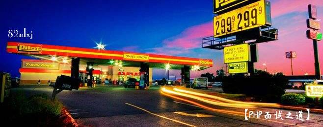

互联网PHP初中高级面试题整理集合
===================

>本项目来源于PHPer蜗牛巢，大部分都是通过互联网以及面试经历来书写。内容包含了初级中级高级PHP开发的面试题。面试主要分两部分，一部分是回顾面试知识点，一部分来源于分析与实际操作。我(@82nlxj)对这部分知识做了一个系统的整理，方便学习查阅。

### 下面请让我吟诗一首（哦，不，是抒发一下）

岁月静好  浅笑而安
        
时光辗转中，掠过红尘繁华，将明媚写进岁月的诗行。

让那些点滴的情愫与感动，婉转成生命的诗章，待经年回眸，不禁莞尔，有泪有笑的人生，才能成就不一样的风景。

时光，是流动的画面，惟愿，岁月静好，许你浅笑而安。
        

这告诉我们，时间辗转之中已渐渐流逝，不学习，不进步，我们将会渐渐退出舞台。所以，奋斗中的我们，现给自己顶一个小目标，比如：赚一个亿先？ 哦哦，这里不吹了！

开始这个面试之道其实很大一部分原因是我认识不少小白或者刚入行一年，两年，三年的PHP开发者，面试都会遇到各种各样的打击。说实话我也被打击过，撕心过，那种感觉就像你连一个屁都不如，菜如狗。所以想利用这段时间，来整理PHP相关面试文章，希望可以以此来加强这些基础薄弱的小伙伴。快速收获大厂的offer！

本教程永久github地址。
https://github.com/82nlxj/phpInterview

##作者
Jonny（ID: 82年的烂香蕉） 

##联系方式
lw1772363381@163.com (Jonny)

PHP面试之基础知识
===================
-  [【面试之道】PHP初级笔试题（一）](https://www.phpassn.com/topics/174/interview-approach-php-primary-written-test-questions-1)
